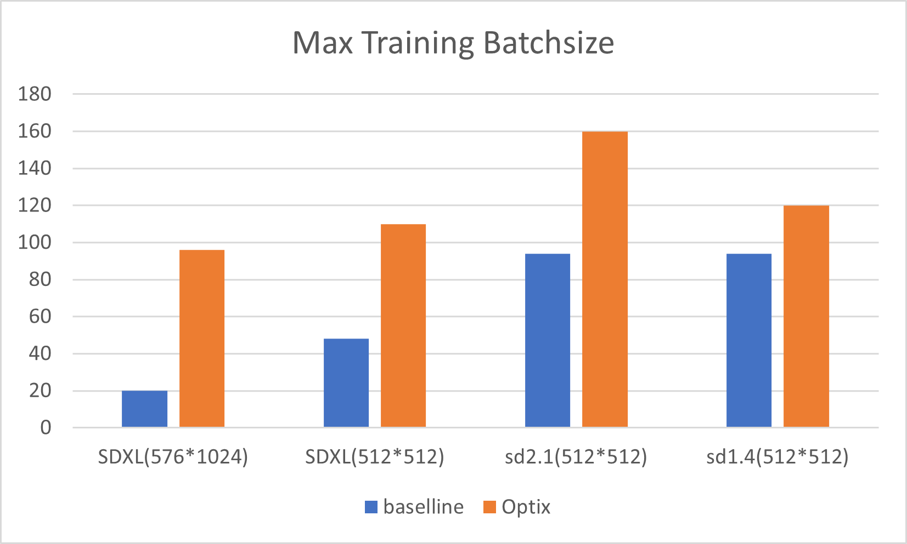
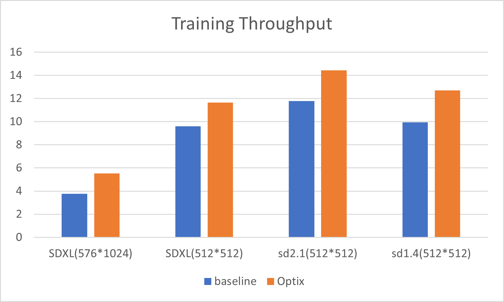

# optix

Optix: Memory Efficient Training Framework for Large Video Generation Model

**Features**:
- 4x the batchsize when training with high resolution images
- average 1.2x the training throughput
- minimize the GPU memory required to train

Results of training stable-diffusion models：





*Basline config*：tf32, grad checkpointing

*Tested on*：A100 80GB; Pytorch2.1.2+cu118


## Getting started

### install optix

`python setup.py develop`

### install dependency

Refer to [requirements](./requiresments.txt)

## API使用

```py
import optix


# optimize model(fusedops, ddp, etc), setup optimizer, and create a ema
model, vae, opt, ema = optix.compile(model, vae, learning_rate=1e-5, weight_decay=1e-5, use_ema=True)

# or do not create ema:
model, vae, opt, _ = optix.compile(model, vae, learning_rate=1e-5, weight_decay=1e-5)


# 使用如下代码代替 model_input = vae.encode(model_input).latent_dist.sample().mul_(vae.config.scaling_factor)
model_input = optix.sliced_vae(vae, model_input, use_autocast=True, nhwc=True)

```

Keyword arguments for `optix.compile` and default value：
```py
{
    'use_ema': False,                   # create ema
    'compile_vae': True,                # [PERF] for torch>2.0, recommended to use torch.compile
    'ddp': True,                        # automatically create a ddp module over unet
    'dp_group': None,                   # ddp communication group, default is None
    'gradient_checkpointing': True,     # [PERF] grad_ckpt is ON by default; for small batchsize this can be turned off for speedup
    'xformer': True,                    # [PERF] use xformer can speedup a little bit
    'fusedln': True,                    # [PERF] use fusedln can speedup
    'compile_unet': False,              # [PERF] this function is not stable so OFF by default
    'vae_channels_last': True,          # [PERF] use channels_last format for vae
    'optim': 'adamw',                   # the optimizer type
    'learning_rate': 1e-5,              # optimizer params
    'weight_decay': 0,                  # optimizer params
    'hybrid_zero': True,                # [PERF] for multi node training, hybrid zero can be faster
}
```
These `Keyword arguments` can be directly passed to `optix.compile` like:
```py
model, vae, opt, _ = optix.compile(model, vae, learning_rate=1e-5, weight_decay=1e-5,
                                   use_ema=False, compile_vae=False, optim='sgd',
                                   xformer=False)

```


## stable diffusion 训练示例

[train_unet.py](./example/train_sd_unet.py)